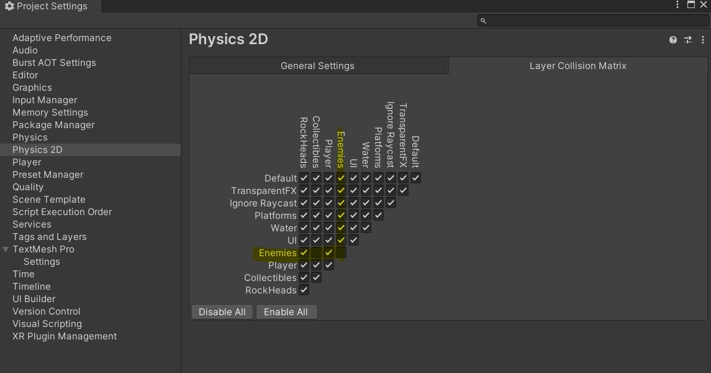
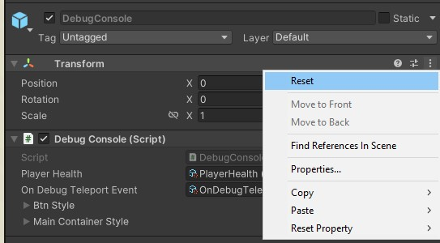

# Mémo Nodes

Dans le but de vous aider à mieux retenir le rôle des différents Nodes que nous avons vu jusqu'à présent, voici un document qui résume leur rôle. A noter tout de même que ce document n'est pas exhaustif et vise à mettre en lumière les points clés de ces composants. Nous vous invitons toujours à vous aider de la documentation si vous avez besoin de plus d'informations et d'exemples.

# Node

Élément de base de tous les éléments dans une scène Godot, le `Node` est la classe que vous utiliserez le plus (indirectement ou non). De conteneur des sprites de votre joueur à l'affichage des points de vie vous aurez besoin d'un `Node`.
Un `Node` est toujours embarqué avec le composant `Transform`, ce dernier gère la Position, la Rotation, la Perspective et l'Échelle d'un objet, pour éviter tout comportement inattendu, pensez toujours à réinitialiser (Reset) un `Node` après avoir ajouté à votre scène, ça vous assure qu'il part de l'origine de votre scène ou de son parent.

En effet, il est possible d'imbriquer un `Node` dans un autre, un peu comme vous le feriez dans Photoshop avec le système de groupes (et sous-groupes). Ce système possède plusieurs avantages :

- Permettre à des `Nodes` de se déplacer ensemble. Par exemple, un objet lié au joueur
- Servir de "dossiers" pour grouper plusieurs `Nodes` et donc mieux organiser votre scène

> N'oubliez pas de changer le nom d'un Node pour le retrouver plus rapidement

## Layer (ou calque en français)

Les layers définissent les interactions entre les GameObjects de votre scène. Tout comme les tags, un GameObject ne peut avoir qu'un seul et un unique layer et est interchangeable aussi bien via le code ou le panneau `Inspector`. Et vous pouvez en ajouter de nouveaux dans la limite de 32 au maximum (2^32).

Les interactions peuvent être de plusieurs ordres. Par exemple, durant nos cours, nous avons défini ce qui est ou non grâce aux layers.

De plus, ils permettent de finir des "groupes" physique de GameObjects. Par exemple, si vous ne souhaitez pas que des ennemis ne puissent pas se gêner en se déplacement, il faudra les mettre dans le même layer puis indiquer à Unity qu'au sein de ce layer les éléments peuvent se traverser. Ceci se fait grâce à la matrice de collision qui se trouve dans le menu `Edit > Project Settings` puis onglet `Physics 2D` et onglet `Layer collision matrix`.

> Attention à ne pas confondre les onglets `Physics 2D` et `Physics`. Si les deux possèdent une matrice de collision, ils n'ont effet qu'en 2D et 3D respectivement (au niveau de leur Rigidbody).

Dans l'exemple ci-dessus, on peut voir que la case est décochée à l'intersection du layer "Enemies". Par conséquent, Unity ignorera les collisions entre tous les GameObjects de ce layer.

Ce mécanisme est très utile si vous souhaitez rendre invincible votre joueur durant quelques instants pour lui permettre de traverser certains layers.

Enfin sachez que les layers sont utilisés notamment avec les Raycasts pour définir avec quoi vous pouvez interagir.

# Transform

Composant par défaut de tout GameObject, **le composant `Transform` ne peut pas être retiré d'un GameObject**. Il représente les composantes : Position,Rotation et Échelle d'un objet

> Pour éviter d'avoir de mauvaises surprises, pensez toujours à réinitialiser (Reset) un Gameobject après avoir ajouté à votre scène. Pour rappel, on fait ceci en cliquant sur les trois petits points situés à droite du nom d'un composant.
> 

La position d'un GameObject existe dans deux espaces un dit "global" (appelé "world" par Unity) et un autre "local". Les deux sont égaux lorsqu'un GameObject est à la racine de la hiérarchie d'une scène, ceci a son importance lorsqu'un GameObject est imbriqué. En effet, lorsque c'est le cas, Unity ne calcule plus la position du GameObject par rapport à l'origine de la scène mais par rapport à l'origine de son parent direct. Ainsi, c'est la position locale qui est affichée dans l'inspecteur.

De ce fait, il existe les propriétés `localPosition` et `position`, la première représant la position local et l'autre globale. Ce raisonnement reste le même pour la rotation et l'échelle d'un GameObject.

Enfin sachez qu'il existe des méthodes pour convertir une position d'un espace à un autre (local/world)

# RigidBody2D

Utilisable uniquement dans un environnement 2D, le composant `Rigidbody2D` soumet un Node au moteur physique de Godot. Ainsi tout GameObject avec un `Rigidbody2D` sera donc attiré par la gravité. En absence de `CollisionShape2D` un Node fera une chute infinie. Avoir des notions de physique de base aide à mieux comprendre le comportement d'un `Rigidbody2D`.

On utilisera ce composant notamment pour déplacer un élément avec la physique.

> N'utilisez pas la propriété `.position` pour déplacer vos Nodes soumis à la physique, si cela peut être tentant, ceci vous expose à la mauvaise détection des collisions entre éléments. Et par conséquent, entraîner des comportements étranges. Par exemple, traverser les murs. Il faut les déplacer grâce à la propriété "velocity".

# StaticBody2D

Cousin du RigidBody2D, le `StaticBody2D` est un Node avec lequel on peut entrer en contact sans le traverser, il n'a pas vocation à bouger, on l'utilisera notamment pour réaliser des obstacles statiques.

Tout comme le Rigidbody2D, le `StaticBody2D` a besoin d'un CollisionShape2D comme enfant.

> N'oubliez pas, un CollisionShape2D n'a pas de forme par défaut, il faudra penser à en mettre une depuis l'onglet "Inspecteur" via la propriété "Shape".

# CharacterBody2D

Si vous avez un élément physique qui doit être contrôlé par le code (joueurs et ennemies), il faudra toujours penser au `CharacterBody2D`, ce composant possède de multiples méthodes clé en main pour déplacer ce type de Node. Un `CharacterBody2D` n'est pas soumis aux règles de la physique comparé à un RigidBody2D.

Pensez à l'accompagner d'un CollisionShape2D.

> A la place d'un CollisionShape2D, vous pouvez utiliser CollisionPolygon2D, ce dernier permet de faire des zones de contacts plus complexes que celles proposées par CollisionShape2D.

# Area2D

Ce Node permet de gérer des zones d'évènements, avertir les nodes intéressés lorsqu'un `Node` entre dedans, ça peut être, par exemple, une zone de fin de niveau. Ce composant doit impérativement avoir comme Node enfant un CollisionShape2D, sinon rien ne pourra être detecté.

Pour notifier les Nodes concernés Godot utilise un système de Signals (signaux), chaque Node possède différents types de Signals accessible depuis l'onglet "Noeud > Signaux", après avoir sélectionné le Node. Godot nous propose un Signal pour l'entrée et un autre pour la sortie.

# Signal

Si vous avez déjà utilisé le patron de conception "Observer", vous êtes plus ou moins familier avec les Signals dans Godot. Ce sont des outils très puissants permettant d'émettre un évènement