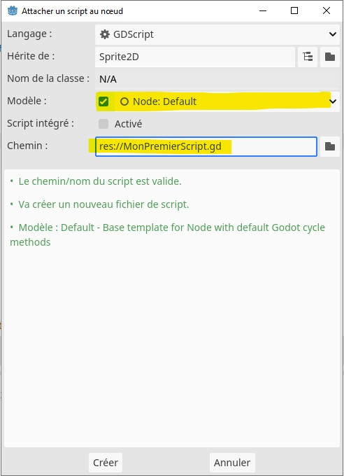

# Découverte de Godot (et du GDScript)
// https://kidscancode.org/godot_recipes/4.x/basics/understanding_delta/index.html
// https://docs.godotengine.org/en/stable/tutorials/scripting/gdscript/gdscript_basics.html
Godot est un logiciel gratuit et open-source pour le développement de jeux vidéo. Comme plein d'outils du même genre, il a été pensé pour rendre accessible le développement de jeux vidéo pour tout le monde. Il se veut complet et gère une bibliothèque complète qui propose notamment la gestion de la physique ou encore de modèles 3D. Mais si ce n'est pas assez, il est possible d'ajouter de nouvelles fonctionnalités grâce au système de plugins dévelopés par la communauté.

- [Accéder à la bibliothèque de plugins (AssetLib)](https://godotengine.org/asset-library/asset)

Grâce à son système de plugins, Godot supporte plusieurs langages de programmation. Toutefois, il ne supporte que deux langages officiellement : le C# (à prononcer see-sharp) et le GDScript. Ce deriner ressemble plus ou moins au lanage Python. S'il est possible d'utiliser, au sein du même projet, du C# et du GDScript, nous utiliserons que le GDScript, et ce, pour deux raisons très simples : syntaxe plus simple et plus performant avec Godot.

> Attention, nous allons utiliser la version 4 de Godot, elle apporte des changements critiques. Si vous copiez du code de la version 3 (ou moins), ceci ne risque pas de fonctionner.

Le but de ce document est de voir ensemble les bases du GDScript qui nous permettront de développer notre premier jeu en 2D. Si vous avez déjà fait du Python, vous ne devriez pas être trop perdu(e), la syntaxe du GDScript est quasiment identique, ainsi, les indentations sont utilisés pour identifier les blocs en lieu et place des accolades ({})

> [Si vous ne l'avez pas fait, pensez à télécharger Godot 4.X. et prenez la version "Godot Engine"](https://godotengine.org/)

## Variables 
Comme tout langage de programmation le GDScript permet de créer des variables, la syntaxe est la suivante (sans les crochets):
```gdscript
var [nom de variable]
```
- nom de variable : si le nom est arbitraire, certains sont interdits et bien évidemment on nommera nos variables avec un nom explicite, c'est pratique pour s'y retrouver

Voici des exemples de variables :
```gdscript
var annees_but = 3
var player_name = "player1"

# Un tableau de chaînes de caractères
var array_formations = ["MMI", "TC", "GE2I", "MT2E"]
```

> Si vous souhaitez définir une constante (variable dont la valeur ne peut pas changer au cours du temps), il suffit juste de mettre "const" devant le type de la variable. Exemple : `const course = "Godot"`.

Bien que facultatif, il est également possible de typer les variables avec le GDScript.
```gdscript
var typed_var: int = 42
# Tableau d'entiers
var scores: Array[int] = [10, 20, 30]
```

## Fonctions

Outils idéaux pour limiter la réutilisation du code et le rendre plus lisible, les fonctions en GDScript se définissent via le mot-clé "func".

```gdscript
func nom_de_fonction(paramètre1, paramètre2):
[indendation] # Instructions
``` 

- nom_de_fonction : Comme les variables, le nom est arbitraire mais certains noms sont interdits et bien évidemment on nommera nos fonctions avec un nom explicite. A noter qu'en GDScript, par convention, les fonctions (et variables) sont écrites en snake_case [(plus d'informations sur snake_case)](https://fr.wikipedia.org/wiki/Snake_case), par convention
- Les paramètres : ils sont infinis dans la signature d'une fonction et sont séparés par une virgule. **Pour rappel, les paramètres d'une fonction ne sont accessibles que dans la fonction qui les définit**

Par exemple, une fonction qui affiche dans la console la somme de deux entiers. **Elle ne retourne rien** :
```gdscript
func addition(num1, num2):
    var sum = num1 + num2
    print(sum)
```

> La méthode `print()` permet d'afficher des choses dans la console de Godot. Il est possible d'afficher plusieurs variables ou valeurs à la suite en les séparant par une virgule (,) ou en faisant une concaténation avec le signe plus (+).

Voici le même exemple, mais cette fois-ci, **notre fonction retourne le résultat** :
```gdscript
func addition(num1, num2):
    var sum = num1 + num2

    return sum

var sum = addition(5, 6)
print("Résultat somme : " + sum)
```

Tout comme les variables, il est possible de typer une fonction (paramètres et retour).
```gdscript
func addition(num1: int, num2: int) -> int:
    var sum = num1 + num2

    return sum
```
Mais ceci reste toujours facultatif.

## Structures conditionnelles (if/elif/else)

Pour les structures conditionnelles type `if/else if/else`, la syntaxe differt. En GDScript, tout comme en Python, on utilise `if/elif/else` respectivement. Par exemple :

```gdscript
if my_var < 10:
    print("Inférieur à 10")
elif my_var == 10 or my_var == 12:
    print("Egal à 10 ou 12")
else:
    print("Autre")
```
> En GDScript (et Python), on préfèrera les opérateurs `and` et `or` à la place de `&&` et `||` respectivement pour des questions de lisibilité.

Il y a d'autres structures de programmation en GDScript, elles ne seront pas toutes abordées. Néanmoins, si vous avez envie de les consulter, il y a la documentation officielle
- [Accéder à la documentation officielle du GDScript](https://docs.godotengine.org/fr/stable/tutorials/scripting/gdscript/gdscript_basics.html#gdscript-reference)

# Script Godot de base

```python
extends Node
```
// https://docs.godotengine.org/en/stable/classes/class_node.html#class-node-method-ready
Ci-dessus vous avez une classe de base, elle hérite de la classe Node. Dans Godot, tout élément est un Node et possède des méthodes suivantes qui seront appelées automatiquement par le moteur :
- _ready : Appelée quand le `Node` ainsi que ses enfants sont prêts
- _process : Appelée toutes les frames/images. Ainsi si votre jeu tourne à 60 images par seconde (ou fps/frames per second), ceci signifie que `_process()` sera appelée 60 fois par seconde, et ce, pour chaque script possédant la méthode `_process()`. Notez tout de même que dépendamment de la puissance de l'appareil qui exécute votre jeu, la méthode `_process()` ne sera pas forcément appelée 60 fois par seconde, ça peut être plus ou moins.

> Pour des questions d'organisation, on mettra tous nos scripts dans un dossier scripts/ qui peut lui même contenir des sous-dossiers

Notez également qu'à chaque fois que vous sauvegardez vos scripts, l'interpréteur vérifie ce que vous avez écrit et lèvera une erreur rendant impossible la compilation du jeu (bouton `Play` en haut à droite ou `ctrl/cmd + b`).

### Déclaration de classe
Dans GDScript bien que c'est un langage orienté objet, il est possible de travailler sans classe

### Méthode `_ready():`
La méthode _ready() est appelée lorsque le Node ainsi que ses enfants sont prêts, autrement dit quand le GameObject apparaît dans la scène (visible ou non). Par exemple, dans un jeu vous pourriez y définir les points de vie de départ d'un Node

### Méthode `_process(delta):`
La méthode `_process(delta)` est appelée toutes les frames/images. Ainsi si votre jeu tourne à 60 images par seconde (ou fps/frames per second), ceci signifie que la méthode `_process(delta)` sera appelée 60 fois durant une seule et unique seconde, et ce, pour chaque script possédant la méthode `_process(delta)`. Notez tout de même que dépendamment de la puissance de l'appareil qui exécute votre jeu, la méthode `_process(delta)` ne sera pas forcément appelée 60 fois par seconde, ça peut être plus ou moins.

La méthode prend en paramètre `delta`, cette valeur représente le temps (en secondes) écoulé entre chaque rafraîchissement d'écran. Ainsi, il est très fortement conseillé d'utiliser ce paramètre lorsque vous effectuez des animations, ceci vous assure que vos animations resteront constantes, et ce, quelque soit la fréquence de rafraîchissement de votre jeu. Exemple :
```gdscript
# Ici on fait bouger un Node en fonction d'une vélocité (Vector2) et du temps écoulé entre deux frames
position += velocity * delta
```

> ** **Attention** **
>
> Ne mettez **jamais** une boucle `while true:` (boucle infinie) dans la méthode `_process():` car Godot plantera à coup sûr car vous faites une imbrication de boucles infinies. Ceci vous forcera également à redémarrer le logiciel et perdre votre travail si vous n'aviez pas sauvegardé juste avant.


# Exercice
Dans le but de découvrir le GDScript, vous allez écrire quelques lignes de code. **Retenez bien que Godot ne peut exécuter un script que s'il est lié à un Node.**
Créez un Node depuis le panneau "Scène" (en haut à gauche, par défaut) en cliquant sur l'icône "+". 
Puis cherchez "Node" et double-cliquez dessus.

Ensuite sélectionnez ce nouveau Node depuis l'onglet "Scène" et cliquez sur `<vide> > Nouveau Script` dans l'onglet "Inspecteur" à droite. Une fenêtre va apparaître, renommez votre script (si vous le souhaitez) et appuyez sur "Créer".

> Assurez-vous d'avoir la case "Modèle" cochée. Ceci permettra d'avoir dans le fichier les méthodes `_ready()` et `_process()`
> 

Le script sera automatiquement ajouté à la racine du projet.

---
> Godot intègre son propre IDE, accessible en double cliquant sur un script ou l'onglet "Script" au milieu de la fenêtre. L'IDE intégré possède différentes options que vous pouvez trouver ailleurs comme l'auto-complétion.

---

**Réalisez les tâches suivantes (n'oubliez pas de retourner le résultat et l'afficher avec la méthode `print()`) :** 
- Un nombre décimal
    - A définir dans la fonction `_ready()`
- Une chaîne de caractères
    - A définir dans la fonction `_ready()`
- Un tableau contenant des nombres
    - A définir dans la fonction `_ready()`
- Une fonction qui **retourne** "Bonjour" + la chaine de caractères passée en paramètre
    - N'oubliez pas d'appeler la fonction et d'utiliser le mot-clé "return"
- Une fonction qui **retourne** un entier passé en paramètre et le multiplie par lui-même
    - N'oubliez pas d'appeler la fonction et d'utiliser le mot-clé "return"
- Une fonction qui fait ce que vous souhaitez mais qui est appelée quand on appuie sur une touche
    - L'appel de la fonction devra impérativement être fait au sein de la méthode `_process()`, sinon ça ne fonctionnera pas (voir exemple plus haut)
    - [Documentation Godot sur la gestion des actions utilisateur - anglais](https://docs.godotengine.org/en/stable/tutorials/inputs/input_examples.html)

> N'oubliez pas de lier votre script à un Node. **Sinon, votre code ne sera jamais exécuté.**

Cette petite mise en bouche n'est là que pour vous faire prendre la main sur le langage GDScript. Durant ce cours, nous aurons l'occasion de faire un petit jeu en 2D où nous aborderons les notions suivantes (liste non exhaustive) :
- Gestion des sprites 2D
- Déplacement du joueur
- Gestion du son / physique
- Animations

## Propriétés exposées
En GDScript, les propriétés de classes n'ont pas de niveau d'accessibilité, autrement dit, n'importe quelle classe peut éditer les propriétés d'une autre classe. Sachez qu'il est également possible d'accéder à ces propriétés depuis l'onglet Inspecteur grâce à l'annotation `@export` qu'on préfixe à la création d'une variable.

```gdscript
# Notre variable "health" sera visible dans l'inspecteur, on pourra donc l'initialiser depuis ce dernier.
@export var health = 4
```

Enfin, n'oubliez pas que Godot est outil très complet, nous n'aurons pas l'occasion de tout voir durant ce cycle de cours. Alors n'hésitez pas à vous renseigner un peu sur le web pour développer le jeu qui vous plait. Utilisez les outils (gratuits) mis à votre disposition pour créer des ressources pour vos créations :
- [Tiled Map Editor](https://thorbjorn.itch.io/tiled)
- [libresprite (version gratuite et moins complète d'aesprite)](https://libresprite.github.io/#!/)
- [Générateur de sprites](https://codeshack.io/images-sprite-sheet-generator/)

Il existe également des sites pour récupérer des ressources gratuites de qualité variable :
- [https://itch.io/](https://itch.io/)
- [https://opengameart.org/](https://opengameart.org/)
- [https://www.mixamo.com/ - Ressources 3D gratuites - Nécessite d'avoir un compte Adobe](https://www.mixamo.com/)


## Si vous souhaitez utiliser git

Vous n'avez pas besoin de pusher tous vos fichiers de travail sur git. Pensez à mettre à la racine de votre projet un fichier .gitignore pour ne pas commiter les fichiers et dossiers inutiles.
- [Télécharger le fichier .gitignore pour Godot](https://github.com/github/gitignore/blob/main/Godot.gitignore)

https://www.youtube.com/watch?v=nAh_Kx5Zh5Q