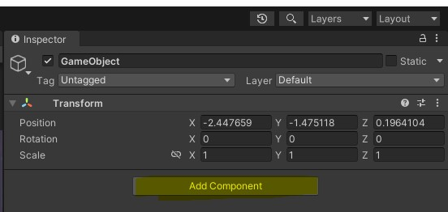

# Découverte de Godot (et du GDScript)
// https://kidscancode.org/godot_recipes/4.x/basics/understanding_delta/index.html
// https://docs.godotengine.org/en/stable/tutorials/scripting/gdscript/gdscript_basics.html
Godot est un logiciel gratuit et open-source pour le développement de jeux vidéo. Comme plein d'outils du même genre, il a été pensé pour rendre accessible le développement de jeux vidéo pour tout le monde. Il se veut complet et gère une bibliothèque complète qui propose notamment la gestion de la physique ou encore de modèles 3D. Mais si ce n'est pas assez, il est possible d'ajouter de nouvelles fonctionnalités grâce au système de plugins dévelopés par la communauté.

- [Accéder à la bibliothèque de plugins (AssetLib)](https://godotengine.org/asset-library/asset)


Grâce à son système de plugins, Godot supporte plusieurs langages de programmation. Toutefois, il ne supporte que deux langages officiellement : le C# (à prononcer see-sharp) et le GDScript. Ce deriner ressemble plus ou moins au lanage Python. S'il est possible d'utiliser, au sein du même projet, du C# et du GDScript, nous utiliserons que le GDScript, et ce, pour deux raisons très simples : syntaxe plus simple et plus performant avec Godot.

> Attention, nous allons utiliser la version 4 de Godot, elle apporte des changements critiques. Si vous copiez du code de la version 3 (ou moins), ceci ne risque pas de fonctionner.

Le but de ce document est de voir ensemble les bases du GDScript qui nous permettront de développer notre premier jeu en 2D. Si vous avez déjà fait du Python, vous ne devriez pas être trop perdu(e), la syntaxe du GDScript est quasiment identique, ainsi, les indentations sont utilisés pour identifier les blocs en lieu et place des accolades ({})

> [Si vous ne l'avez pas fait, pensez à télécharger Godot 4.X. et prenez la version "Godot Engine"](https://godotengine.org/)

## Variables 
Comme tout langage de programmation le GDScript permet de créer des variables, la syntaxe est la suivante (sans les crochets):
```gdscript
var [nom de variable]
```
- nom de variable : si le nom est arbitraire, certains sont interdits et bien évidemment on nommera nos variables avec un nom explicite, c'est pratique pour s'y retrouver

Voici des exemples de variables :
```python
var annees_but = 3
var player_name = "player1"

// Un tableau de chaînes de caractères
var array_formations = ["MMI", "TC", "GE2I", "MT2E"]
```

> Si vous souhaitez définir une constante (variable dont la valeur ne peut pas changer au cours du temps), il suffit juste de mettre "const" devant le type de la variable. Exemple : `const course = "Godot"`.

Bien que facultatif, il est également possible de typer les variables avec le GDScript.
```python
var typed_var: int = 42
```

## Fonctions

Outils idéaux pour limiter la réutilisation du code et le rendre plus lisible, les fonctions en GDScript se définissent via le mot-clé "func".


```python
func nom_de_fonction(paramètre1, paramètre2):
[indendation] # Instructions
``` 

- nom_de_fonction : Comme les variables, le nom est arbitraire mais certains noms sont interdits et bien évidemment on nommera nos fonctions avec un nom explicite. A noter qu'en GDScript, par convention, les fonctions (et variables) sont écrites en snake_case [(plus d'informations sur snake_case)](https://fr.wikipedia.org/wiki/Snake_case), par convention
- Les paramètres : ils sont infinis dans la signature d'une fonction et sont séparés par une virgule. **Pour rappel, les paramètres d'une fonction ne sont accessibles que dans la fonction qui les définit**

Par exemple, une fonction qui affiche dans la console la somme de deux entiers. **Elle ne renvoie rien** :
```cs
func addition(num1, num2):
    var sum = num1 + num2
    print(sum)
```

> La méthode `print()` permet d'afficher des choses dans la console de Godot. Il est possible d'afficher plusieurs variables ou valeurs à la suite en les séparant par une virgule (,) ou en faisant une concaténation avec le signe plus (+).


Voici le même exemple, mais cette fois-ci, **notre fonction retourne le résultat** :
```python
# On précise qu'on retourne un entier avec int avant le nom de la fonction
func addition(num1, num2):
    var sum = num1 + num2

    return sum

var sum = addition(5, 6)
print("Résultat somme : " + sum)
```

Pour les structures conditionnelles type `if/else if/else`, la syntaxe differt. En GDScript, tout comme en Python, on utilise `if/elif/else` respectivement. Par exemple :

```python
if my_var < 10:
    print("Inférieur à 10")
elif my_var == 10 or my_var == 12:
    print("Egal à 10 ou 12")
else:
    print("Autre")
```
> En GDScript (et Python), on préfèrera les opérateurs `and` et `or` à la place de `&&` et `||` respectivement.

Il y a d'autres structures de programmation en GDScript, elles ne seront pas toutes abordées. Néanmoins, si vous avez envie de les consulter, il y a la documentation officielle
- [Accéder à la documentation officielle du GDScript](https://docs.godotengine.org/en/stable/tutorials/scripting/gdscript/gdscript_basics.html#gdscript-reference)

# Script Unity de base

```python
extends Node
```
Ci-dessus vous avez une classe de base, elle hérite de la classe Node. Dans Godot, tout élément est un Node et donc possède des méthodes suivantes qui seront appelées automatiquement par le moteur :
- _ready : Appelée quand le `Node` ainsi que ses enfants sont prêts
- _process : Appelée toutes les frames/images. Ainsi si votre jeu tourne à 60 images par seconde (ou fps/frames per second), ceci signifie que `_process()` sera appelée 60 fois par seconde, et ce, pour chaque script possédant la méthode `_process()`. Notez tout de même que dépendamment de la puissance de l'appareil qui exécute votre jeu, la méthode `_process()` ne sera pas forcément appelée 60 fois par seconde, ça peut être plus ou moins.


> ~~**Le nom de classe (ici MyClass) et le nom du fichier doivent toujours correspondre (casse comprise) sinon Unity lèvera une erreur.**~~ Dans notre cas, la classe MyClass est contenue dans un fichier appelé MyClass.cs. On s'assurera qu'une classe a le même nom que le fichier.
>
> **Pour des questions d'organisation, on mettra tous nos scripts Unity dans un dossier Scripts/ contenu lui-même dans le dossier Assets/,** ce dernier est déjà généré par Unity lorsque vous créez un nouveau projet. Notez également qu'à chaque fois que vous sauvegardez vos scripts et retournez sur Unity, il fera une vérification du code et toute erreur trouvée rendra impossible la compilation (mode `Play` ou `ctrl/cmd + p`).

### Déclaration de classe : `public class MyClass : MonoBehaviour`
Cette ligne nous permet de définir notre classe. Le mot-clé `public` nous permet d'accéder à notre classe partout dans notre projet. Nous verrons plus loin dans le document que le terme "public" peut être remplacé par d'autres mot-clés. Ensuite nous avons le type, ici `class`, nous définissons donc une classe qui a pour nom "MyClass". La synaxe `: MonoBehaviour` désigne l'héritage. Autrement dit, notre classe `MyClass` possède les caractéristiques de la classe `MonoBehaviour`, c'est ce qui nous permet d'utiliser les méthodes `Start()` ou `Update()`. Car la class `MonoBehaviour` contient déjà ces méthodes avec leur comportement.

### Méthode : `Start() {}`
La méthode Start() est appelée lorsque le script est instancié, autrement dit quand le GameObject apparaît dans la scène (visible ou non). Par exemple, dans un jeu vous pourriez y définir les points de vie de départ d'un personnage

### Méthode : `Update() {}`
La méthode Update est appelée toutes les frames/images. Ainsi si votre jeu tourne à 60 images par seconde (ou fps/frames per second), ceci signifie que la méthode Update() sera appelée 60 fois durant une seule et unique seconde, et ce, pour chaque script possédant la méthode `Update()`. Notez tout de même que dépendamment de la puissance de l'appareil qui exécute votre jeu, la méthode `Update()` ne sera pas forcément appelée 60 fois par seconde, ça peut être plus ou moins.
Parallèlement, c'est dans cette méthode que vous vérifierez les touches appuyées. Par exemple :

```cs
/* [...] */
void Update()
{
    // Ici on appelle le contenu du "if"
    // quand la touche V du clavier est appuyée
    if (Input.GetKeyDown(KeyCode.V))
    {
        // Mes instructions
        Debug.Log("J'ai appuyé sur la touche V");
    }
}
```
> ** **Attention** **
>
> Ne mettez **jamais** une boucle `while(true) {}` (boucle infinie) dans la méthode Update car Unity plantera à coup sûr car vous faites une imbrication de boucles infinies. Ceci vous forcera également à redémarrer le logiciel et perdre votre travail si vous n'aviez pas sauvegardé.

Enfin, notez les choses suivantes sur les classes :
- Les méthodes telles que `Start()` ou `Update()` sont propres à la classe `MonoBehaviour`, de ce fait, elles sont automatiquement appelées
- Toutes les classes n'ont pas à hériter de `MonoBehaviour`
    - Nous aurons l'occasion de réaliser des classes n'héritant pas de MonoBehaviour dans ce cours
- Il est possible de définir plusieurs classes dans le même fichier
- Vous pouvez définir des propriétés propres à une classe. On les met au début de la classe pour les retrouver plus facilement. Nous aurons l'occasion de voir ceci durant le cours
- `MonoBehaviour` possède d'autres méthodes (nous en utiliseront d'autres), prenez bien en compte que ces méthodes ont un ordre d'appel
    - [Voir ordre d'exécution des méthodes de `MonoBehaviour` (anglais)](https://docs.unity3d.com/Manual/ExecutionOrder.html)

# Exercice
Dans le but de découvrir le C#, vous allez écrire quelques lignes de code. **Retenez bien qu'Unity ne peut exécuter un script que s'il est lié à un GameObject.**
Créez un GameObject depuis le panneau "Hierarchy" `Clic droit > Create Empty` ou encore depuis le menu `Game Object > Create Empty`. Puis dans la fenêtre "Inspector", cliquez sur "Add Component" et écrivez le nom de votre script (au choix) puis cliquez sur "New script" ensuite "Create and Add" (le script sera automatiquement ajouté au dossier `Assets/`).

 

---
> Il est possible de développer en C# avec n'importe quel logiciel. Toutefois, nous vous recommendons d'utiliser un logiciel qui gère Unity, ceci vous permettra d'avoir l'auto-complétion des différentes méthodes et classes pour ainsi être plus productif.
Si vous utilisez Visual Studio (pas VS Code, c'est différent) tout sera géré nativement après avoir installé Unity, il faut quand même sélectionner les extensions liées à Unity lors de l'installation. 

Si vous souhaitez utiliser VS Code, vous devrez suivre la démarche suivante :
- [Extension VS Code - Unity](https://devblogs.microsoft.com/visualstudio/announcing-the-unity-extension-for-visual-studio-code/)

> Il ne faut en aucun cas installer le package "Visual Studio **Code** Editor", il est désuet et provoquera des conflits avec Visual Studio Code et à coup sûr, vous n'aurez pas l'auto-complétion de code. 

Après avoir configuré votre IDE pour gérer C# et Unity, il faudra également indiquer à Unity que vous aller utiliser cet IDE pour développer. Pour ce faire, il faudra procéder de la façon suivante :
- MacOS : 
  - Cliquez sur `Unity` en haut à gauche dans la barre de statut
  - Sélectionnez `Settings`, une fenêtre va apparaître
  - Sélectionnez `External Tools` dans le menu à gauche 
  - Sélectionnez la liste déroulante du choix `External Script Editor` et choissiez votre IDE (VS Code, Visual Studio, Sublime Text...) 
- Windows :
  - Cliquez sur le menu `Edit > Preferences`
  - Sélectionnez `External Tools` dans le menu à gauche 
  - Sélectionnez la liste déroulante du choix `External Script Editor` et choissiez votre IDE (VS Code, Visual Studio, Sublime Text...)
[Plus d'informations ici](https://learn.unity.com/tutorial/set-your-default-script-editor-ide#)

Si tout a bien été pris en compte, votre IDE devrait s'ouvrir si vous allez dans le menu : `Assets > Open C# Project`.

~~Enfin, il vous faudra aussi installer le SDK .NET, il est disponible gratuitement sur le site de Microsoft :~~
- ~~[Télécharger le SDK .NET](https://dot.net/core-sdk-vscode)~~
~~Attention tout de même, dans certains cas l'installation du SDK peut mal se dérouler et vous n'aurez pas l'autocomplétion des méthodes d'Unity. Il faudra vous réferrer au lien suivant pour résoudre votre problème :~~
- ~~[Aide sur les problèmes de SDK .NET - anglais](https://github.com/OmniSharp/omnisharp-vscode/wiki/Troubleshooting:-'The-.NET-Core-SDK-cannot-be-located.'-errors)~~

Et pour vous assurer que vous avez bien l'auto-complétion des méthodes d'Unity commencez à écrire "OnColli", votre logiciel devrait vous faire des propositions dont "OnCollisionExit2D" ou "OnCollisionEnter".

Si ça ne fonctionne toujours pas avec tout ça, vous pouvez tenter de résoudre votre problème en installant Mono qui est lui aussi gratuit :
- [Télécharger Mono](https://www.mono-project.com/download/stable/#download-win)

---

**Réalisez les tâches suivantes (n'oubliez pas de retourner le résultat et l'afficher avec la méthode `Debug.Log()`) :** 
- Un nombre décimal
    - A définir dans la fonction `Start()`
- Une chaîne de caractères
    - A définir dans la fonction `Start()`
- Un tableau contenant des nombres
    - A définir dans la fonction `Start()`
- Une fonction qui **retourne** "Bonjour" + la chaine de caractères passée en paramètre
    - N'oubliez pas d'appeler la fonction et d'utiliser le mot-clé "return"
- Une fonction qui **retourne** un entier passé en paramètre et le multiplie par lui-même
    - N'oubliez pas d'appeler la fonction et d'utiliser le mot-clé "return"
- Une fonction qui fait ce que vous souhaitez mais qui est appelée quand on appuie sur une touche
    - L'appel de la fonction devra impérativement être fait au sein de la méthode `Update()`, sinon ça ne fonctionnera pas (voir exemple plus haut)
    - [Documentation Unity de la liste des touches accessibles - anglais](https://docs.unity3d.com/ScriptReference/KeyCode.html)

> N'oubliez pas de lier votre script à un GameObject. **Sinon, votre code ne sera jamais exécuté.**

Cette petite mise en bouche n'est là que pour vous faire prendre la main sur le langage C#. Durant ce cours, nous aurons l'occasion de faire un petit jeu en 2D où nous aborderons les notions suivantes (liste non exhaustive) :
- Gestion des sprites 2D
- Déplacement du joueur
- Gestion du son / physique
- Animation
- ScriptableObject

## Propriétés de classes
Au sein d'une classe, les variables définies en dehors d'une fonction ont une portée qui leur est spécifique. Autrement dit, elles n'existent que dans un contexte que vous aurez défini. Ces variables sont appelées **propriétés de classes**. Elle peuvent être globales ou non à votre projet. Leur syntaxe est semblable aux variables à la différence que vous pouvez définir leur accessibilité. Exemple :

```cs
[niveau d’accessibilité] [type] [nom de variable] = valeur;
```
- Niveau d’accessibilité : Peut avoir la valeur "protected", "public", "private" et autres. Dans le cadre du cours nous utiliserons principalement :
    - public : On peut la lire (et la modifier) depuis n'importe où dans notre projet. Le fait qu'elle soit publique rend possible sa modification depuis l'onglet "Inspector" d'Unity
    - private : **la propriété n'est accessible qu'au sein de la classe** qui la définit et seule cette dernière peut la modifier et y accéder
        - Par défaut, les méthodes et les propriétés sont privées en C#, mais pensez à le préciser.
- Type et nom de variable : On l'a vu précemment
- Valeur : Facultatif, une propriété de classe peut ne pas être définie au début et l'être plus tard dans le code. A noter que si vous définissez une valeur par défaut pour une propriété et que vous définissez une valeur pour cette même propriété dans l'`Inspector`, c'est cette dernière qui sera prise en code

> Note : Ce n'est pas une bonne pratique de tout mettre en "public". Rendre tout "public" rend possible à n'importe quelle classe la possibilité d'en modifier une autre. Ce qui peut rendre le debuggage très compliqué. Toutefois pour rendre les choses simples, nous utiliserons le mot-clé "public" dans le cadre du cours. Mais nous vous encourageons très fortement à utiliser "private" quand c'est possible.
> - [Pour en savoir plus (anglais)](https://www.youtube.com/watch?v=pD27YuJG3L8)
> - [Documentation sur les niveaux d'accessibilité](https://learn.microsoft.com/fr-fr/dotnet/csharp/programming-guide/classes-and-structs/access-modifiers)

> Note 2 : cette notion d’accessibilité est également applicable aux classes et aux fonctions au sein d'une classe (qu'on appelle "méthode")

Par convention, ces propriétés de classes sont définies au début d'une classe. Exemple :
```cs
/* [...] */
public class MyClass : MonoBehaviour
{
    // Ces propriétés sont accessibles partout au sein de notre classe "MyClass"
    public string universityName = "CY Paris Université";
    private int nbYearsBUT = 3;

    void Start()
    {
        // Note : Avec le caractère $, il est possible d'afficher une variable dans une chaîne de caractères
        Debug.Log($"nbYearsBUT {nbYearsBUT}");
    }

    public void MyMethod() {
        nbYearsBUT = 7;
    }

    private void MyPrivateMethod() {
        nbYearsBUT = 5;
    }
    /* [...] */
}
```
Il existe d'autres conventions de programmation liée à Unity / C#, vous n'avez pas forcément besoin de les suivre à la lettre mais de rester cohérent dans votre projet.
- [Ensemble de conventions de programmation en C# / Unity - anglais](https://unity.com/how-to/naming-and-code-style-tips-c-scripting-unity)

> Le formattage de texte est possible avec des balises ressemblant à du HTML. Ainsi en écrivant `Debug.Log("<color=red>Message :</color> Texte formatté.")`, une partie du texte sera rouge dans la console.

Enfin, n'oubliez pas qu'Unity est outil très complet, nous n'aurons pas l'occasion de tout voir durant ce cycle de cours. Alors n'hésitez pas à vous renseigner un peu sur le web pour développer le jeu qui vous plait. Utilisez les outils (gratuits) mis à votre disposition pour créer des ressources pour vos créations :
- [Tiled Map Editor](https://thorbjorn.itch.io/tiled)
- [libresprite (version gratuite et moins complète d'aesprite)](https://libresprite.github.io/#!/)
- [Générateur de sprites](https://codeshack.io/images-sprite-sheet-generator/)
- [Convertisseur image -> police d'écriture](https://yal.cc/r/20/pixelfont/)

Il existe également des sites pour récupérer des ressources gratuites de qualité variable :
- [https://itch.io/](https://itch.io/)
- [https://opengameart.org/](https://opengameart.org/)
- [https://www.mixamo.com/ - Ressources 3D gratuites - Nécessite d'avoir un compte Adobe](https://www.mixamo.com/)

Nous verrons dans les grandes lignes l'interface d'Unity. Néanmoins, si vous avez besoin, à l'avenir, d'un rappel ou de découvrir de nouvelles choses : 
- [Voir présentation de l'interface d'Unity par Tuto Unity FR (français)](https://www.youtube.com/watch?v=Ef6KMvYNwj8)

Voici un lien qui liste les différents raccourcis d'Unity, ils pourront vous être utiles :
- [https://www.evercast.us/blog/unity-hotkeys-shortcuts (anglais)](https://www.evercast.us/blog/unity-hotkeys-shortcuts)
- Il y a également le menu dédié accessible via `Edit > Shortcuts` (Windows) ou `Unity > Shortcuts` (MacOS)

> Point important : Pour vous éviter des déconvenues lors de la réouverture de votre travail. Nous vous conseillons très fortement de fermer (et sauvegarder) Unity avant d'éteindre votre ordinateur. Car Unity ne sauvegarde pas automatiquement votre projet (pas officiellement) et vous pourriez perdre quelques heures de travail précieuses.

## Si vous n'avez pas d'ordinateur portable

Dans le cas où vous ne possez pas d'ordinateur portable et que vous souhaiteriez continuer vos projets à la maison. Ne copiez pas tout votre projet sur une clé USB ou un dépôt git. Seuls les dossiers/fichiers suivants sont importants, le reste Unity les recrée lorsqu'ils sont manquants.

### Liste de dossiers/fichiers à copier sur une clef usb / disque dur ou pousser sur git
- Assets/
- Packages/
- ProjectSettings/
- UserSettings/

**N'allez pas copier/pousser les dossiers Logs/ ou Library/, ils sont très lourds et contiennent de nombreux dossiers imbriqués et inutiles au bon fonctionnement du projet. Unity les crée à l'ouverture du projet s'ils sont manquants.** Si vous utilisez git, pensez à mettre à la racine de votre projet un fichier .gitignore pour ne pas commiter les fichiers et dossiers inutiles.
- [Télécharger le fichier .gitignore pour Unity](https://github.com/github/gitignore/blob/main/Unity.gitignore)