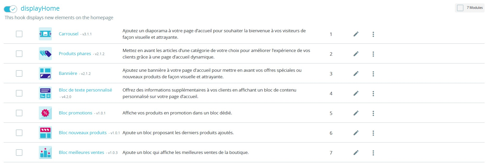

# Modules

Jusqu'à présent, nous avons vu qu'il était possible de modifier le HTML et le CSS d'une thème grâce au thème enfant ou en modifiant directement le thème (mauvaise idée si ce thème n'a pas été crée par votre personne). Il existe un troisième moyen de personnaliser votre thème, et ce, sans écrire une ligne de code : les modules.

Équivalents des plugins sous Wordpress, les modules permettent d'étendre les fonctionnalités de votre site Prestashop pour qu'il puisse être le plus proche de vos besoins et ceux de votre client.

Les modules sont disponibles sur le marketplace de Prestashop (back-office > Modules > Marketplace) ou sur un site dédié ([accéder au Marketplace](https://addons.prestashop.com/fr/)). Ils sont partagés en deux catégories :
- front-office : Modifient la partie front-office de votre site, ce que le cleint final voit
- back-office : Modifient uniquement l'administration du site

- [Didacticiel vidéo sur l'installation de module - anglais](https://www.youtube.com/watch?v=nG3VSMQ593s&t=125s)

> Tout comme les thèmes un module peut être payant. Certains sont mêmes avec abonnement.

Pour installer un module, il vous suffit de cliquer sur le bouton "Installer un module" et glisser-déposer l'archive de votre module. Dépendemment de la configuration de votre serveur, il est possible qu'un message d'erreur s'affiche expliquant que l'archive est trop lourde. Il vous faudra changer la valeur de "upload_max_filesize" dans le fichier "php.ini" de votre version de php.

Pour voir les modules qui sont présents sur votre site, il vous suffit d'aller dans le menu dédié (back-office > Modules > Gestionnaire de modules). Vous les trouverez classés par catégorie. Les modules propres à votre thème sont dans la catégorie "Theme modules", vous pouvez également les chercher grâce à la barre de recherche.

> Comme les thèmes, vous pouvez bien créer vos propres modules, ceci nécessite de développer en PHP

Essayons de retirer le carrousel du thème. 
1. Recherchez "carrousel" dans la barre de recherche
1. Cliquez sur la flèche associée pour faire apparaître un sous-menu
1. Sélectionnez "Désactiver"
1. Validez votre choix
1. Patientez
1. Retournez sur votre site, le "carrousel" devrait ne plus être présent

Chaque module peut être configuré (en fonction), désactivé ou encore désinstallé. La différence entre "désactiver" et "désinstaller" est qu'en cas de changement de thème un module "désactivé" risque de revenir. Désinstallez un module si et seulement si vous êtes sûr(e) que nous n'en aurez plus besoin.

## Positionnement

En plus d'ajouter ou retirer des modules, il est également possible d'en changer la position. C'est dans le menu (back-office > Apparence > Positions) qu'il vous est donné cette possibilité.

Prestashop orchestre ses modules autour de hooks ("crochet" en anglais), autrement dit des emplacements où peuvent se greffer ou non vos modules. Et au sein de ces hooks vous pouvez changer l'ordre d'un module. Exemple : 
|  |
|:---:|
| _Le hook "displayHome" représente le contenu principal de la page d'accueil_ |

Ainsi en réordonnant les éléments de ce hook (glisser-déposer), vous changerez l'apparence de la page d'accueil. Et ce, sans avoir écrit une seule ligne de code.

> En cliquant sur les trois-points à droite d'un module, vous pouvez "dégreffer" un module. Cette option permet de retirer un module pour un hook précis. Contrairement à "désactiver" et "désinstaller" qui se propagent sur tout le site.

Il existe deux types de hooks :
- D'action : se produisent quand une action spécifique se produit (connexion, renouvellement de mot de passe...)
- D'affichage : Lorsqu'on affiche une page spécifique. Comme la page d'accueil (vu précédemment)

> [En savoir plus sur les hooks - anglais](https://devdocs.prestashop-project.org/8/modules/concepts/hooks/)

Quand vous créez vos propres modules, il faudra bien également définir leurs hooks. Sinon vous ne pourrez jamais les afficher.

> Vous ne pouvez pas afficher plusieurs fois le même module dans le même hook.

___
## Exercice :
- Essayez de changer l'ordre d'affichage des modules de la page d'accueil (hook "displayHome"). Consultez les modifications dans le front-office
- Essayez de retirer des hooks. Consultez les modifications dans le front-office
- Ajoutez le module Stripe. Stripe est une solution de paiement. Vous n'aurez pas besoin d'utiliser une vraie carte de paiement. Stripe nous permet d'utiliser de fausses cartes, vous pourrez trouver les informations ici : [https://stripe.com/docs/testing#cards](https://stripe.com/docs/testing#cards)
    - [Télécharger le module Stripe - Assurez-vous de prendre la version pour Prestashop 8](https://addons.prestashop.com/fr/paiement-carte-wallet/24922-stripe-official-pret-pour-la-sca.html)
    
    Pour que vous puissiez simuler le paiement, vous aurez besoin d'utiliser des clés d'authentification. Elles sont dans un fichier sur l'ENT.

> Nous avons fait le choix d'effectuer le paiement avec Stripe. Toutefois, il existe d'autres alternatives comme [Mollie](https://www.mollie.com/fr) ou encore [Stancer](https://www.stancer.com/fr/). D'ailleurs Stancer propose, sous réserve d'avoir un nom de domaine, un hébergement de site Prestashop.
___

Si vous souhaitez rajouter un hook, il y a le bouton "greffer un module" en haut à droite. Dans le formulaire, il vous faudra indiquer le module, le hook où il devra se greffer et ensuite sauvegarder.

