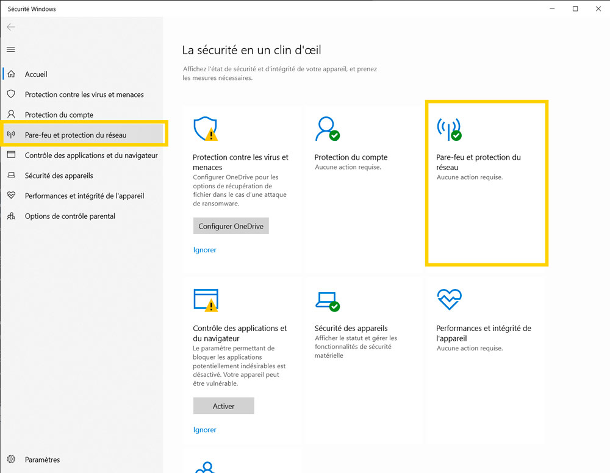
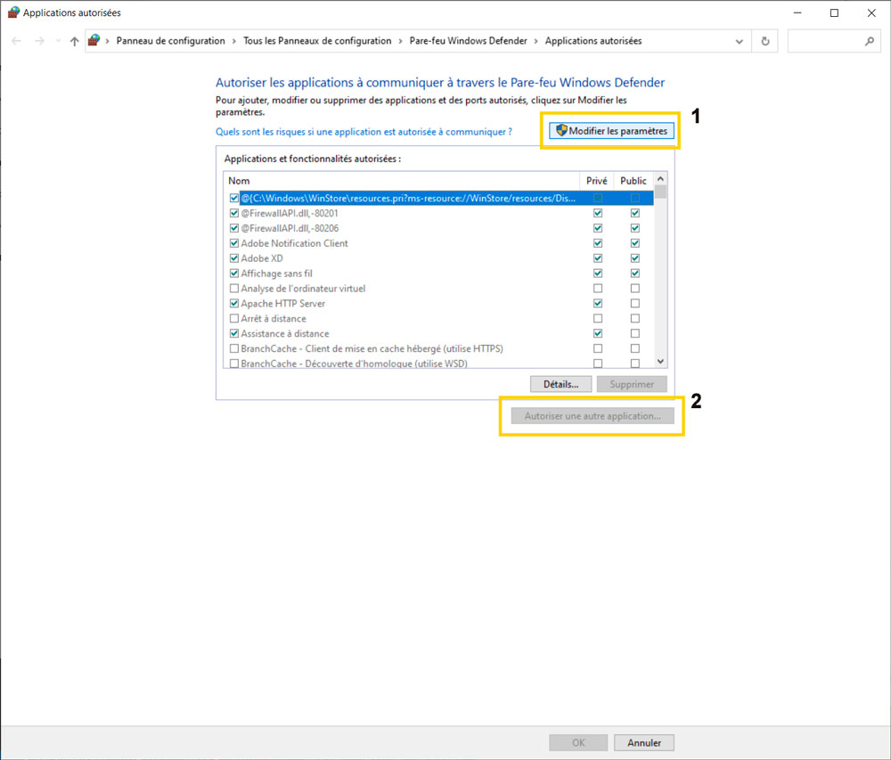
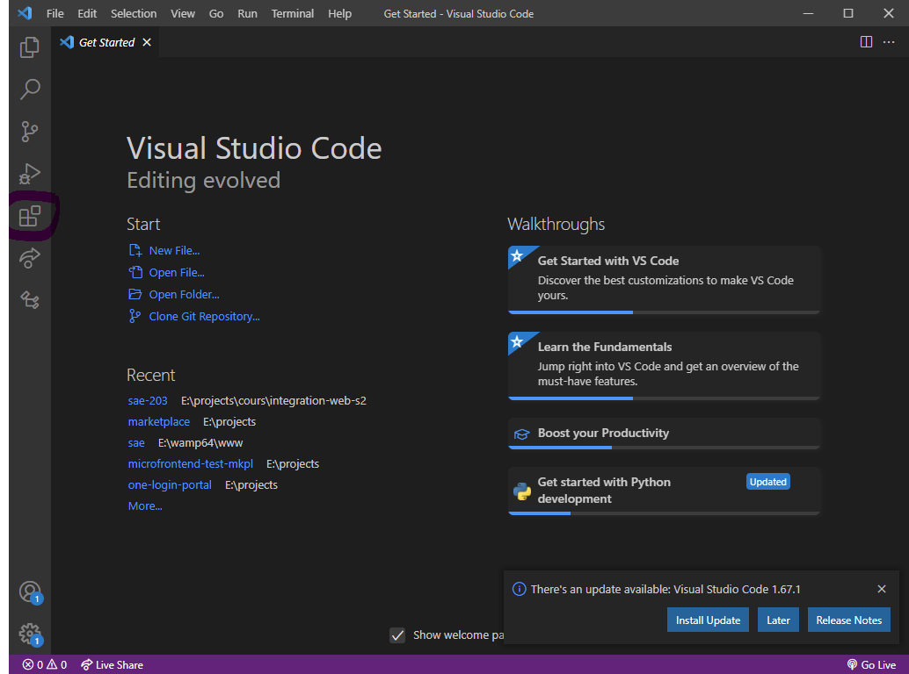
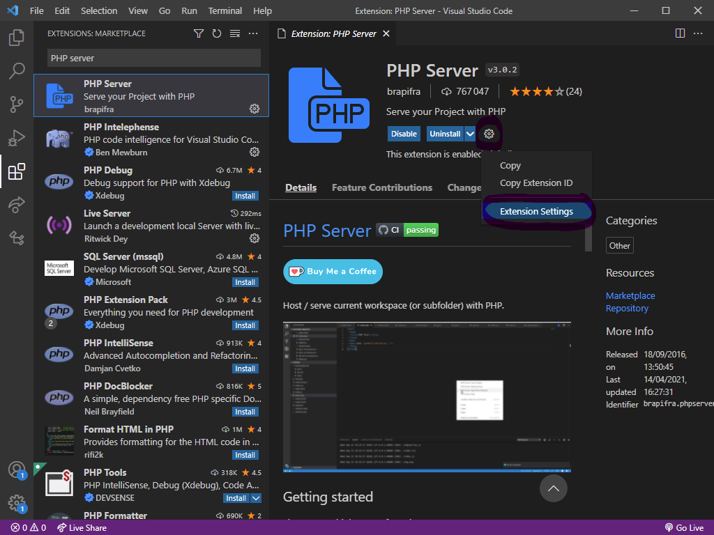
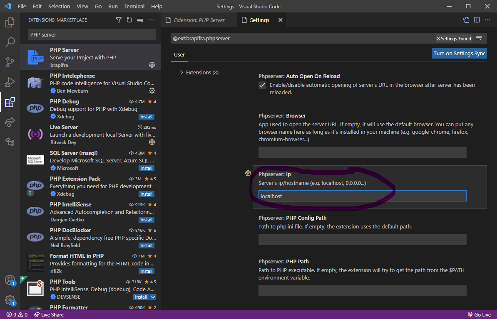
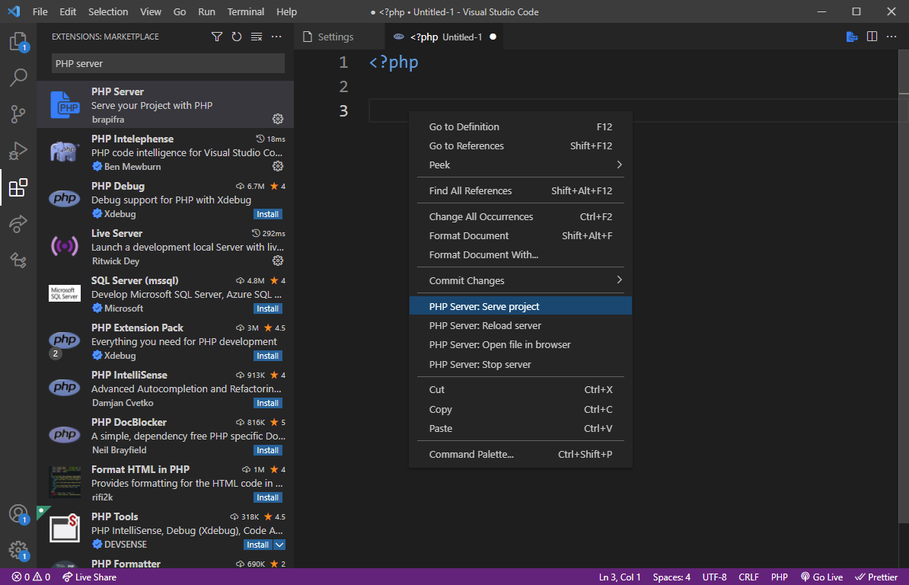

L'utilisation de l'extenson liveshare de VS Code est très pratique pour travailler en groupe sur le même projet. Néanmoins, vous avez dû remarquer que si vous pouvez bien modifier les fichiers chez l'hôte, il vous est impossible de voir les modifications sur votre ordinateur local, ce qui limite fortement le travail collaboratif.

> Note : **Les instructions suivantes ne fonctionneront que si et seulement si les conditions suivantes sont toutes réunies :**
> - Les ordinateurs, qui veulent voir les modifications en local, sont sur le même réseau. Par exemple à l'IUT.
> - Le projet tourne sur un serveur (MAMP/WAMP/XAMPP...)

Nous allons, vous proposer deux méthodes :
- Utilisation de l'extension gratuite VS Code "PHP Server" - Plus simple
- Modification de la configuration de MAMP/XAMPP/WAMPP - Plus "compliqué"

**Quelque soit la solution choisie, une seule personne a besoin de partager son serveur à la fois.**
# Récupérer son adresse ip locale

Dans le but de partager votre serveur avec des tiers, qui sont sur le même réseau, il faut faudra impérativement récupérer votre adresse ip **locale**. Dépendamment de votre système d'exploitation l'exécution n'est pas la même.

### Windows

1. Ouvrez l'application "invite de commande"
2. Ecrivez la commande  `ipconfig` et appuyez sur la touche `Entrée`

3. Récupérez l'adresse ip locale et transmettez-la aux membres de votre groupe

### MacOS
1. Ouvrez l'application "Préférences système"
2. Choississez le menu "Réseau"

3. Sélectionnez la méthode connexion utilisée et récupérez l'adresse ip locale et transmettez-la aux membres de votre groupe

Une fois que vous avez récupérer l'adresse ip local de votre serveur (l'ordinateur qui fait le partage liveshare), vous pouvez la partager avec les membres de votre groupe qui pourront accéder au site depuis le navigateur de leur ordinateur. Par exemple 192.168.X.X/sae203.

# Partage de serveur - WAMP/MAMP/XAMPP

Si les conditions précédentes sont remplies, l'ordinateur hôte (celui qui lance le serveur liveshare) doit récupérer son adresse ip locale et la partager avec les membres de son groupe. Ainsi, vous pourrez tous éditer les fichiers du même projet et consulter les modifications sur votre ordinateur.
##### Note pour les hôtes sous Windows - Windows 10

Le système d'exploitation peut potentiellement bloquer les requêtes venant de l'extérieur en direction de votre serveur. Dans le cas où l'hôte est sous Windows, il vous faudra rajouter le serveur au pare-feu Windows. Pour ce faire, suivez les étapes suivantes :

1. Ouvrez le logiciel "Sécurité Windows". Vous pouvez utiliser le raccourci `Windows + S` pour afficher le menu de recherche.

2. Sélectionnez "Pare-feu et protection du réseau"

3. Sélectionnez "Autoriser une application via le pare-feu"

4. Sélectionnez "Modifier les paramètres" puis "Autoriser une autre application"
   - Cliquer sur "Modifier les paramètres" va activer "Autoriser une autre application"

5. Cliquez sur le bouton "Parcourir" puis sélectionnez le fichier `httpd.exe` dans le dossier `wamp64\bin\apache\apache2.4.51\bin` et validez l'opération

Il vous faudra également éditer le fichier `httpd-vhosts.conf`. Pour y accéder et l'éditer suivez les étapes suivantes :

1. Cliquez sur le logo de WAMP dans la barre de status de Windows. Puis Survolez "Apache ..."

2. Cliquez sur `httpd-vhosts.conf`
   - Ceci va ouvrir un logiciel avec le fichier `httpd-vhosts.conf`

3. Remplacez dans le fichier "Require local" en "Require all granted" puis sauvegardez le fichier
4. Redémarrez le WAMP

Maintenant l'accès depuis l'extérieur au serveur hôte fonctionnera.

Maintenant, vous pouvez tous travailler sur le même projet tout en voyant les modifications en local.

> Note : Des manipulations supplémentaires peuvent être à effectuer **si l'ordinateur hôte utilise XAMPP**. Vous trouverez des informations sur ce site : [Accéder au didacticiel (anglais)](
https://www.mrtekno.net/2019/08/how-to-access-localhost-xampp-vm.html)

# Partage de serveur - VS Code

Vs Code permet l'utilisation d'extension. La place de marché des extensions est accessible en cliquant sur les quatre carrés à gauche de la fenêtre du logiciel. 

1. Recherchez "PHP Server"

2. Sélectionnez l'extension "PHP Server" et installez-la en cliquant sur le bouton "Install"

Une fois l'installation effectuée, vous ne verrez aucune modification visuelle dans VS Code, toutefois, vous avez accès à un nouveau menu contextuel lorsque vous ferez un clic droit dans un fichier PHP. Mais avant d'expérimenter ceci, nous allons devoir faire quelques modifications dans les options de l'extension.

1. Retournez dans le menu "Extension", cherchez et sélectionnez "PHP Server"
2. Cliquez sur la roue dentée et sélectionnez "Extension Settings"

3. Remplacez "localhost" par votre adresse ip locale

L'extension est maintenat prête. Vous pouvez donc aller ouvrir un fichier .php du projet avec VSCode puis faire un clic droit. Sélectionnez l'option "PHP Server: Serve project".

Normalement, un onglet va être ouvert dans votre navigateur par défaut. Et des utilisateurs externes pourront accéder à votre projet via votre adresse ip, et ce, tant que votre serveur tournera.

---
L'accès à votre travail local peut également être accessible à distance, mais ceci nécessite des outils externes comme localtunnel (gratuit) - [accéder au site de localtunnel](https://localtunnel.github.io/www/).