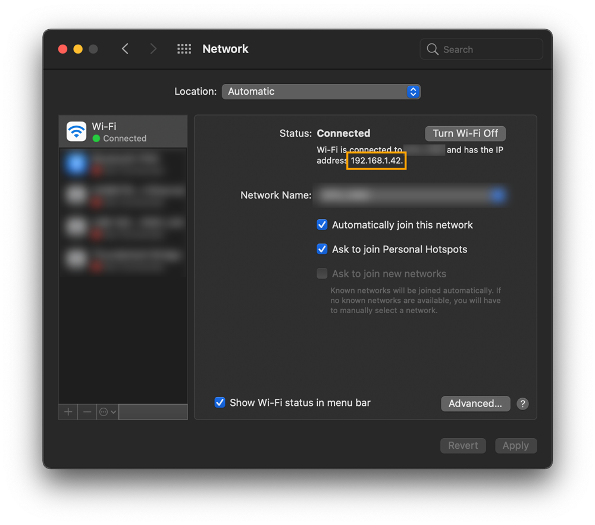

# Travailler avec Liveshare et partager votre serveur

L'utilisation de l'extenson liveshare de VS Code est très pratique pour travailler en groupe sur le même projet. Néanmoins, vous avez dû remarquer que si vous pouvez bien modifier les fichiers chez l'hôte, il vous est impossible de voir les modifications sur votre ordinateur local.

> Note : Les instructions suivantes ne fonctionneront que si et seulement si les conditions suivantes sont toutes réunies :
> - Les ordinateurs, qui veulent voir les modifications en local, sont sur le même réseau. Par exemple à l'IUT.
> - Le projet tourne sur un serveur (MAMP/WAMP/XAMPP...)

Si les conditions précédentes sont remplies, l'ordinateur hôte (celui qui lance le serveur liveshare) doit récupérer son adresse ip locale et la partager avec les membres de son groupe. Ainsi, vous pourrez tous éditer les fichiers du même projet et consulter les modifications sur votre ordinateur.

### Obtenir son adresse IP locale

#### Windows

1. Ouvrez l'application "invite de commande"
2. Ecrivez la commande  `ipconfig`
3. Tapez sur la touche `Entrée`
4. Récupérez l'adresse ip locale et transmettez-la aux membres de votre groupe

#### MacOS
1. Ouvrez l'application "Préférences système"
2. Choississez le menu "Réseau"

3. Sélectionnez la méthode connexion utilisée et récupérez l'adresse ip locale et transmettez-la aux membres de votre groupe

Les membres de votre groupe n'auront qu'à accéder à l'adresse ip depuis le navigateur de leur ordinateur.

Maintenant, vous pouvez tous travailler sur le même projet tout en voyant les modifications en local.

> Note : Des manipulations supplémentaires peuvent être à effectuer **si l'ordinateur hôte utilise XAMPP**. Vous trouverez des informations sur ce site : [Accéder au didacticiel (anglais)](
https://www.mrtekno.net/2019/08/how-to-access-localhost-xampp-vm.html)

Ceci peut également fonctionner à distance, mais ceci nécessite des outils externes comme localtunnel (gratuit) - [accéder au site de localtunnel](https://localtunnel.github.io/www/).